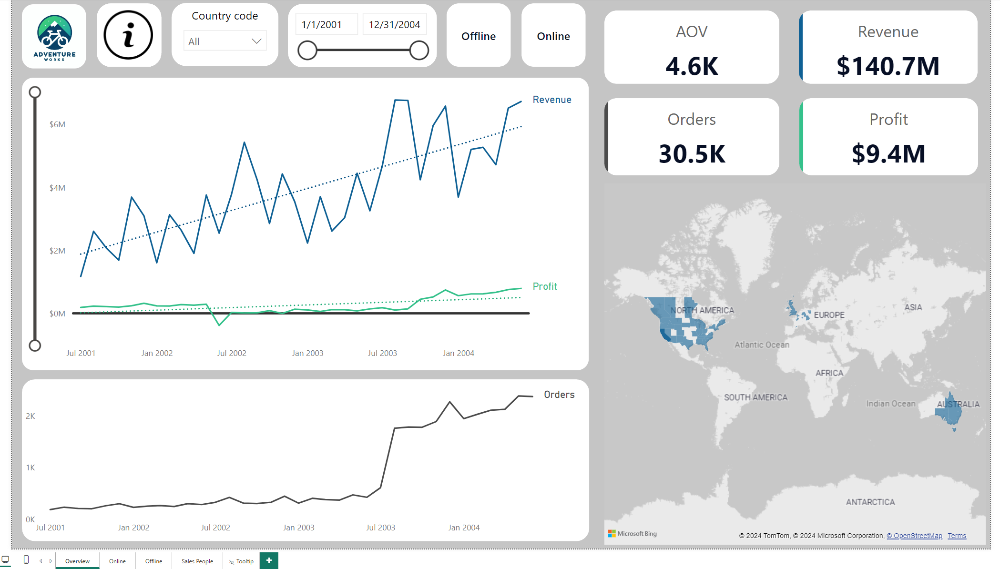
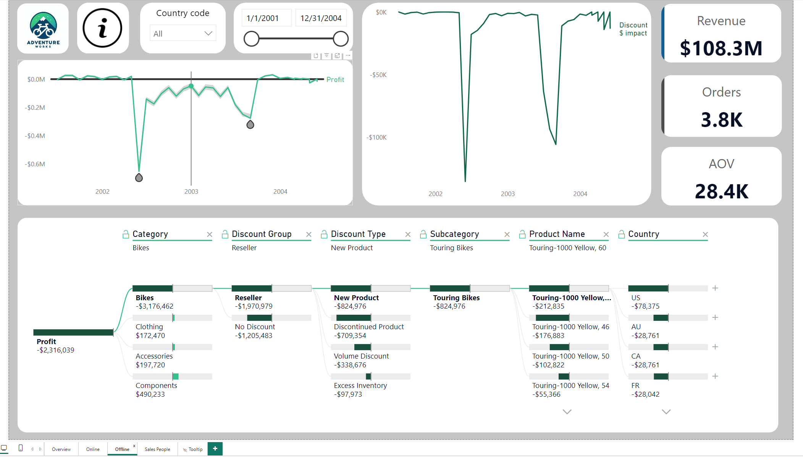
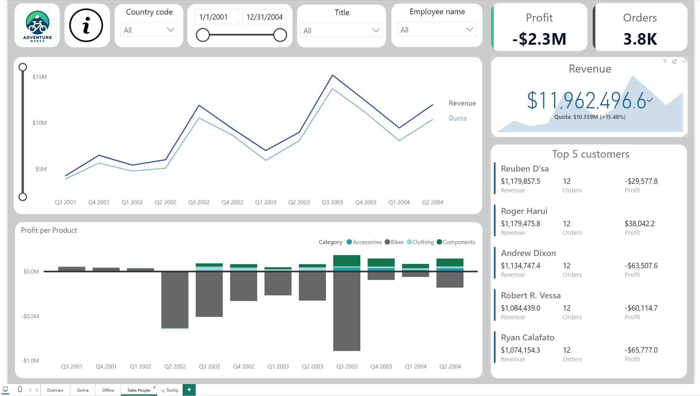

# AdventureWorks Sales Analysis

## Project Overview

This project provides a strategic analysis of AdventureWorks sales data, focusing on both online and offline sales channels over a 3-year period. The goal is to inform executive leadership and the sales department on current sales performance, profitability, and areas for potential improvement. This analysis also addresses the impact of product categories, especially bikes, on overall profitability and provides strategic recommendations for optimizing sales channels.

## Dataset Information

This project uses the AdventureWorks dataset provided by Microsoft, available for download and installation [here](https://learn.microsoft.com/en-us/sql/samples/adventureworks-install-configure?view=sql-server-ver16&tabs=ssms). The dataset is intended for educational and demonstration purposes. Redistribution or commercial use may be restricted under Microsoft’s general terms for sample databases.

## Objectives

1. **Perform data cleaning and validation**

    Conduct data cleaning to ensure the quality and reliability of the dataset before analysis. This process included removing inconsistencies and validating data accuracy to prepare for accurate insights. Notably, data from July 2004 was excluded because offline sales were missing. That is likely due to their fiscal year starting at July, Q3, as seen in table with quota information. Thus, at that time, it was in progress. 
    
2. **Explore and identify key insights**

    Conduct a thorough analysis of the available data to uncover interesting and valuable insights. The goal was to identify trends, patterns, and key metrics that could provide strategic value and inform decision-making of executive team and sales department.

3. **Develop a comprehensive dashboard**

    Create a dashboard that effectively presents the most compelling insights discovered during the analysis. The dashboard should be structured to display data in an engaging and easily understandable way, tailored to the interests and needs of both executive leadership and the sales department:
    - Executives require high-level strategic insights that emphasize overall performance metrics and impact.
    - The Sales Department needs detailed, actionable data to guide day-to-day operations and sales strategy.

4. **Prepare for targeted presentations**

    Develop presentations based on the dashboard insights, tailored for two distinct audiences: executive leadership and the sales department. Each presentation should address the specific priorities of its audience. Also, during presentation, techniques used to hold the audience's attention should be used, thus information had to be spread out strategically and use needed animations for it. 

## Tech Stack

- **SQL** – for data extraction, cleaning, and aggregation to ensure that the necessary data was prepared for analysis and star schema relationships could be formed in the dashboard.
- **Power BI** – used to create interactive dashboard that displays key insights.
- **PowerPoint** – employed to develop presentations tailored for executive leadership and the sales department.

## Key Findings

 

### Offline Sales 

- This channel primarily serves as a distribution network for B2B (Business-to-Business) sales, targeting resellers It generated higher total revenue of **108.3M** over a 3-year period but experienced a significant loss in profit amounting to **-2.3M**. Main causes were:
    - Bikes were the only unprofitable category but had the most significant impact, resulting in over -3.1M in losses over the entire period. 
        - Road bikes being the ones contributing the most - over -2.4M of lost profit. 
        - Touring bikes were responsible for an additional -1.2M in losses.
        - Only Mountain bikes were profitable, generating over 0.5M in profit.
    - Other product categories brought profit, but only around 860k combined.
    - Starting from Q2 2002, bikes became unprofitable, marking a key shift in the channel's financial performance. Some of the lowest moments were caused by:
        - Sales people quota increased since then, especially in 2002 and 2003 Q3. During those periods company was not profitable. 
        - The discontinuation of Mountain bike models 100 and 500 in June 2002, sold to resellers at a discount, resulting in over -617K in lost profit. 
        - The release of two new Touring bike models in September 2003 accompanied by promotional pricing for resellers, contributing to an additional -340K in profit loss.    
        
### Online Sales

- This channel focuses on B2C (Business-to-Consumer) sales, targeting end-users. Although total revenue was lower at **32.4M**, online sales were highly profitable, generating **11.7M** in profit. Key points include:
    - The introduction of new product categories (accessories and clothing) in July 2003 significantly boosted monthly orders from around 300 to over 3,000. These categories were not the primary profit drivers but contributed to increased sales volume.
    - Bikes accounted for 95% of all profits, with Road bikes alone contributing 45%. This trend contrasted sharply with the offline channel, where Road bikes were unprofitable.
    - The rise in bike orders after the introduction of new product categories suggests that these items may have attracted more customers who eventually purchased bikes.
    - Most orders (97%) were made without discounts, highlighting strong pricing power. Despite this, 62% of customers identified price as a top reason for their purchase, showing that competitive pricing without heavy discounts was effective.

## Recommendations

### Refocus Sales Strategy on Profitable Channels and Products

- Shift focus to online sales. Prioritize online channels due to their higher profitability and growth potential.
- Invest in targeted online campaigns. Use digital marketing channels to promote high-performing categories online such as accessories and bikes, focusing on promotions that emphasize value and quality offered for a competitive price.
- Pause and evaluate reasons of selling unprofitable offline bike lines: Road and Touring bikes. 

### Revise Product Offering and Sales Channels

- Expand product categories by increasing focus on components to diversify the product lineup and reduce reliance on lower-margin bike models.
- Reevaluate reseller strategy. Analyze the profitability of reseller partnerships, particularly for offline channels, and consider direct sales for higher margins.

### Update Sales Quotas and Improve Tracking

- Revise quotas to align sales with historical performance data for realistic and achievable targets.
- Investigate reasons for unmet quotas by certain sales people.

## Possible Analysis Improvements

1. Analyze cross-category purchases to understand if customers buying accessories or clothing are more likely to purchase bikes or is it a coincidence only. 
2. Investigate the impact of discounts on sales and profitability, particularly in the online channel. While most sales occurred without discounts, understanding the effectiveness of strategic discounting could reveal opportunities to boost sales without significantly eroding profit margins.
3. Drill down into the offline sales data to assess individual salesperson performance in terms of profitability. This analysis could identify if specific people or teams biggest contributors to unprofitability of online sales (maybe by goaling ineffectively, trying to boost their performance numbers, etc.).
4. Include a deeper analysis of costs associated with each sales channel and product line, factoring in logistics, marketing, and operational expenses. This would provide a clearer picture of net profitability and help refine strategies to enhance margins. 

## How to Use This Repository

1. **"adventureworks_dashboard"** -  Power BI dashboard file providing an interactive analysis of AdventureWorks' sales data. Open this file in Microsoft Power BI Desktop to view and interact with the data visualizations..
2. **"presentations"** - contains 2 presentations: 1 for executive leadership and 1 for sales department.
3. **"images"** - screenshots of dashboard tabs for quick reference on how the final Power BI version looks.
4. **"queries"** - SQL query files used for data extraction and preparation for the dashboard.

## Contact

LinkedIn - [Agnė Vabalaitė](www.linkedin.com/in/agnė-vabalaitė).
Gmail - vab.agne@gmail.com